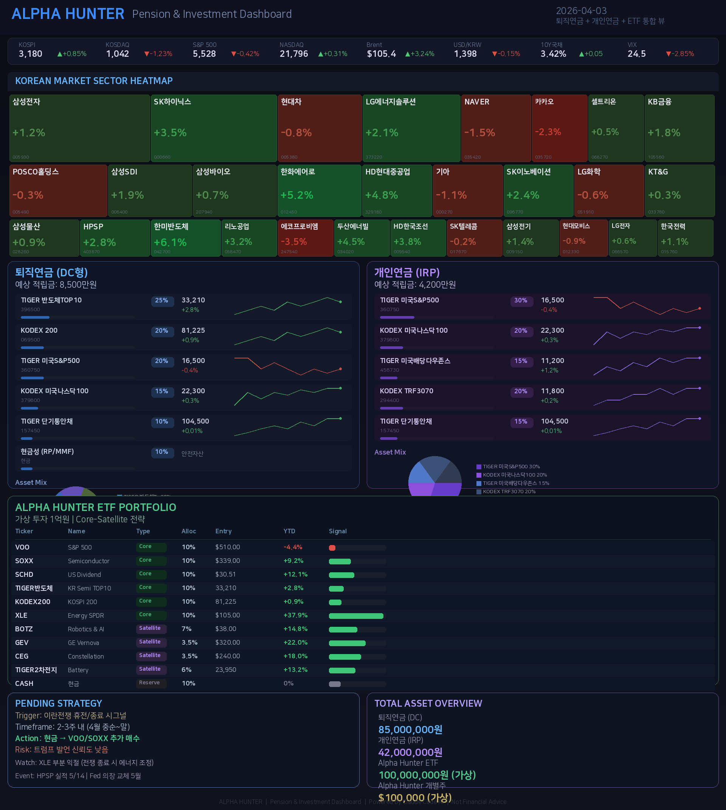
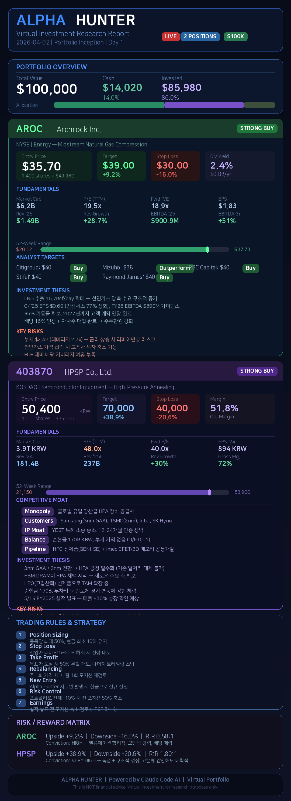
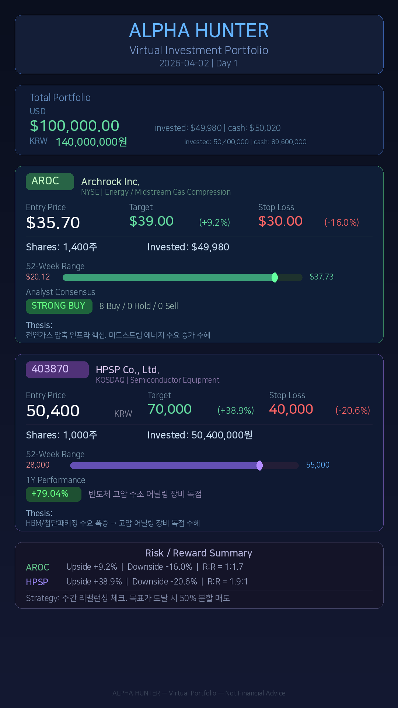

# Alpha Hunter - AI-Powered Virtual Investment Dashboard

> 비개발자가 Claude Code AI와 협업하여 만든 투자 리서치 & 포트폴리오 관리 시스템

## What is this?

**Alpha Hunter**는 Claude Code AI가 자동으로 생성하는 투자 분석 시스템입니다.

- Wall Street TOP 10 종목 분석 (Goldman, JPM, MS, BofA, Citi)
- 한국/미국 시장 섹터 히트맵 (FinViz 스타일)
- 퇴직연금(DC) / 개인연금(IRP) 대시보드
- ETF 포트폴리오 추적 (Core-Satellite 전략)
- 개별종목 딥 리서치 (AROC, HPSP)
- Quarto 인터랙티브 HTML 보고서
- 매일 아침 자동 브리핑 (Telegram 전송)

## Screenshots

### FinViz-Style Pension Dashboard


### Individual Stock Report


### Portfolio Overview


## How it works

```
1. 웹 검색 → 최신 시장 데이터 수집
2. AI 분석 → 종목 리서치, 섹터 로테이션, 리스크 평가
3. 시각화 → Python (Pillow) 카드뉴스 / Quarto HTML 보고서
4. 자동 전송 → Telegram 봇으로 매일 아침 8시 브리핑
5. 지식 축적 → Karpathy 방법론 (raw/ → wiki/) 적용
```

## Files

| File | Description |
|------|-------------|
| `pension_dashboard.py` | FinViz 스타일 통합 대시보드 생성기 |
| `generate_report.py` | 개별종목 딥 리서치 이미지 생성기 |
| `portfolio_card.py` | 포트폴리오 현황판 생성기 |
| `daily_report.qmd` | Quarto 인터랙티브 HTML 보고서 |
| `portfolio.json` | 개별종목 포트폴리오 데이터 (AROC, HPSP) |
| `etf_portfolio.json` | ETF 포트폴리오 데이터 (1억원, 10종목) |

## Portfolio Strategy

### ETF Portfolio (1억원 가상투자)

**Core (60%):** VOO, SOXX, SCHD, TIGER반도체TOP10, KODEX200, XLE

**Satellite (20%):** BOTZ, GEV, CEG, TIGER 2차전지

**Cash (10%):** 전쟁종료 시 저점매수 실탄

### Individual Stocks ($100K 가상투자)

- **AROC** (Archrock) — 천연가스 압축, Strong Buy 8/0/0
- **HPSP** (403870) — 반도체 HPA 장비 독점, Strong Buy 8/1/0

## Tech Stack

- **Python** — Pillow (이미지 생성), Matplotlib
- **R / Quarto** — ggplot2, plotly, DT (인터랙티브 보고서)
- **Claude Code AI** — 리서치, 분석, 코드 생성, 시각화
- **Telegram Bot** — 자동 보고서 전송
- **Cron** — 매일 8AM (평일), 매주 월 9AM 스케줄

## Knowledge Base (Karpathy Method)

```
knowledge/
├── raw/     ← 원본 리서치 자료 (.md)
├── wiki/    ← LLM이 자동 유지하는 위키 + INDEX
├── outputs/ ← 생성된 보고서/이미지 재투입
└── compile.sh ← 통계 스크립트
```

## Disclaimer

이 프로젝트는 **가상 투자 시뮬레이션** 목적으로 작성되었습니다.
실제 투자 권유가 아니며, 모든 투자 결정은 개인의 판단과 책임 하에 이루어져야 합니다.

---

**Built with Claude Code AI** | Not a developer — just a human with ideas and an AI partner.
