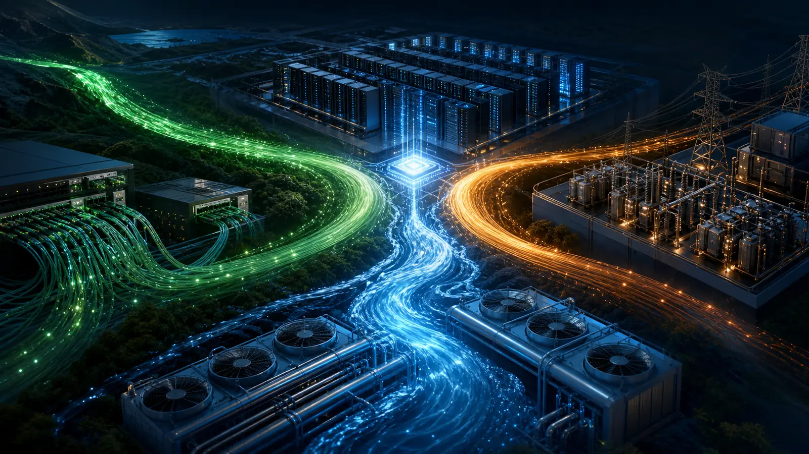

{.hero width=100% fig-alt="광통신 전력 냉각 흐름이 데이터센터에 합쳐지는 모습"}

::: {.callout-note}
## 비교 질문
GPU 수요가 계속돼도 어떤 기업은 왜 더 민감하게 반응하는가? 답은 **어느 병목에 노출됐고, 그 수요가 수주·매출·현금으로 언제 전환되는가**에 있다.
:::

# 관찰 우주

| 병목 | 후보 | 관찰 포인트 | 주요 위험 |
|---|---|---|---|
| 전력·열 | VRT | UPS·열관리·액체냉각 | 밸류에이션, 프로젝트 지연 |
| 데이터센터 건설 | FIX | 기계·전기·배관 시공 | 인력·원가·대형 프로젝트 집중 |
| 전자 제조 | CLS | 서버·네트워크 제조 | 고객 집중, 마진 구조 |
| 광부품 | COHR | 레이저·트랜시버 부품 | 재고·가격·중국 노출 |
| 고속 연결 | CRDO | SerDes·AEC·DSP | 제품 집중, 변동성 |
| 배전 장비 | POWL | 스위치기어·전력 제어 | 수주 주기, 산업 CAPEX |
| 광 네트워크 | CIEN | 광전송·스위칭 | 통신사 CAPEX 순환 |

# 시장이 매긴 1년 위치

```{=html}
<svg viewBox="0 0 760 360" role="img" aria-label="후보 종목 52주 범위 내 현재 위치" style="width:100%;background:#fff;border-radius:14px"><g font-family="system-ui,sans-serif"><text x="22" y="32" font-size="19" font-weight="700" fill="#145c43">52주 저점=0, 고점=100에서 현재 위치</text><g font-size="12" fill="#1f2937"><text x="22" y="82">VRT</text><rect x="90" y="65" width="510" height="20" rx="10" fill="#e5ece9"/><rect x="90" y="65" width="121" height="20" rx="10" fill="#4aa982"/><text x="620" y="82">23.8</text><text x="22" y="122">FIX</text><rect x="90" y="105" width="510" height="20" rx="10" fill="#e5ece9"/><rect x="90" y="105" width="387" height="20" rx="10" fill="#4aa982"/><text x="620" y="122">75.9</text><text x="22" y="162">CLS</text><rect x="90" y="145" width="510" height="20" rx="10" fill="#e5ece9"/><rect x="90" y="145" width="263" height="20" rx="10" fill="#4aa982"/><text x="620" y="162">51.6</text><text x="22" y="202">COHR</text><rect x="90" y="185" width="510" height="20" rx="10" fill="#e5ece9"/><rect x="90" y="185" width="261" height="20" rx="10" fill="#4aa982"/><text x="620" y="202">51.2</text><text x="22" y="242">CRDO</text><rect x="90" y="225" width="510" height="20" rx="10" fill="#e5ece9"/><rect x="90" y="225" width="284" height="20" rx="10" fill="#4aa982"/><text x="620" y="242">55.7</text><text x="22" y="282">POWL</text><rect x="90" y="265" width="510" height="20" rx="10" fill="#e5ece9"/><rect x="90" y="265" width="276" height="20" rx="10" fill="#4aa982"/><text x="620" y="282">54.1</text><text x="22" y="322">CIEN</text><rect x="90" y="305" width="510" height="20" rx="10" fill="#e5ece9"/><rect x="90" y="305" width="286" height="20" rx="10" fill="#4aa982"/><text x="620" y="322">56.1</text></g><text x="22" y="350" font-size="11" fill="#6b7280">Yahoo Finance 조정주가, 2026-07-31 종가. 위치는 (현재−저점)/(고점−저점).</text></g></svg>
```

FIX만 52주 범위의 상단 4분의 1에 남아 있다. 그러나 앞선 보고서처럼 MA50 아래이므로 “강한 사업 테마”와 “지금의 추세 조건”을 분리해야 한다.

# 세 갈래의 서로 다른 신호

## 광통신

<span class="pill">CRDO</span><span class="pill">COHR</span><span class="pill">CIEN</span>은 같은 광 테마라도 반도체, 부품, 시스템으로 매출 인식 위치가 다르다. 대역폭 수요만 보지 말고 고객 집중, 재고, 매출총이익률을 함께 확인한다.

## 전력

<span class="pill">POWL</span><span class="pill">VRT</span>은 데이터센터가 전력망에 연결돼야 매출이 실현되는 병목에 가깝다. 수주잔고는 선행 신호지만 취소·납기·원가가 현금화를 좌우한다.

## 건설·냉각

<span class="pill">FIX</span><span class="pill">VRT</span>은 설비투자가 물리적 공간으로 변환되는 구간이다. AI 모델 성능보다 현장 인력, 장비 조달, 인허가가 더 큰 변수가 될 수 있다.

# 체크리스트

- 공식 실적의 유기적 매출 성장과 수주잔고
- 매출총이익률·현금흐름이 매출과 함께 개선되는지
- 고객 한 곳의 CAPEX 변화에 얼마나 노출되는지
- 기술 대체와 자체 설계 위험
- 주가가 MA50·MA150·MA200을 회복했는지

이 비교는 종목 추천이나 목표가격 제시가 아니다. 동일한 AI CAPEX라는 이야기 아래 서로 다른 현금흐름과 리스크가 있음을 보여주는 연구용 지도다.
