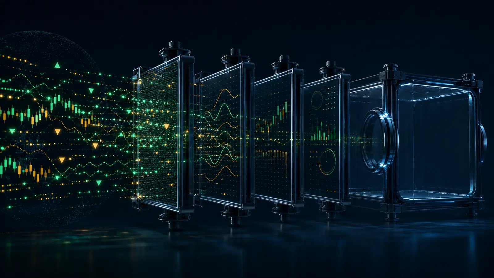

{.hero width=100% fig-alt="여러 주식 신호가 필터를 통과하지만 최종 상자가 비어 있는 모습"}

::: {.callout-warning}
## 결론
AI 인프라 후보 7개 중 **엄격한 기술 조건을 모두 통과한 종목은 0개**다. 시장이 흔들릴 때 기준을 낮춰 두 종목을 채우는 것보다 “없음”을 발행하는 편이 재현 가능하다.
:::

# 검사 규칙

가격 기준일은 미국 시장 2026년 7월 31일 종가다. 조정주가 1년 일봉으로 아래 조건을 우선 검사했다.

- 현재가 > 50일 이동평균
- 현재가 > 150일 이동평균
- 현재가 > 200일 이동평균
- 150일선 > 200일선
- 현재가가 52주 저점보다 충분히 높고, 고점 대비 과도하게 훼손되지 않을 것

이는 Minervini식 추세 템플릿의 축약형이다. 펀더멘털 성장성은 기술 조건을 통과한 뒤 공식 실적으로 확인하는 순서다.

# 결과

| 종목 | 현재가 | MA50 | MA150 | MA200 | 50일선 판정 |
|---|---:|---:|---:|---:|---|
| VRT | $241.57 | $305.72 | $269.71 | $246.24 | <span class="fail">탈락</span> |
| FIX | $1,729.69 | $1,817.66 | $1,551.13 | $1,397.41 | <span class="fail">탈락</span> |
| CLS | $331.44 | $360.51 | $332.52 | $327.13 | <span class="fail">탈락</span> |
| COHR | $262.89 | $347.42 | $289.29 | $254.95 | <span class="fail">탈락</span> |
| CRDO | $206.99 | $233.84 | $169.39 | $166.05 | <span class="fail">탈락</span> |
| POWL | $208.68 | $263.97 | $216.11 | $190.55 | <span class="fail">탈락</span> |
| CIEN | $377.05 | $463.51 | $402.89 | $351.26 | <span class="fail">탈락</span> |

```{=html}
<svg viewBox="0 0 760 350" role="img" aria-label="현재가의 50일 이동평균 대비 비율" style="width:100%;background:#fff;border-radius:14px"><g font-family="system-ui,sans-serif"><text x="22" y="32" font-size="19" font-weight="700" fill="#145c43">현재가 ÷ MA50 — 1.00 이상만 1차 통과</text><line x1="530" y1="55" x2="530" y2="325" stroke="#da4b44" stroke-width="2" stroke-dasharray="6 4"/><g font-size="12" fill="#1f2937"><text x="22" y="79">VRT</text><rect x="90" y="62" width="348" height="23" fill="#f29a8f"/><text x="448" y="79">0.79</text><text x="22" y="119">FIX</text><rect x="90" y="102" width="418" height="23" fill="#e2a65d"/><text x="518" y="119">0.95</text><text x="22" y="159">CLS</text><rect x="90" y="142" width="405" height="23" fill="#e2a65d"/><text x="505" y="159">0.92</text><text x="22" y="199">COHR</text><rect x="90" y="182" width="334" height="23" fill="#f29a8f"/><text x="434" y="199">0.76</text><text x="22" y="239">CRDO</text><rect x="90" y="222" width="392" height="23" fill="#e2a65d"/><text x="492" y="239">0.89</text><text x="22" y="279">POWL</text><rect x="90" y="262" width="348" height="23" fill="#f29a8f"/><text x="448" y="279">0.79</text><text x="22" y="319">CIEN</text><rect x="90" y="302" width="357" height="23" fill="#f29a8f"/><text x="457" y="319">0.81</text></g></g></svg>
```

데이터 출처: Yahoo Finance Chart API의 1년 조정주가를 2026-08-02 KST에 조회해 단순이동평균을 계산했다. 가격은 분할·배당 조정 및 공급자 정정에 따라 달라질 수 있다.

# 근접 후보

**FIX**는 MA150·MA200 위이고 장기 추세 배열도 양호하지만 MA50보다 약 4.8% 낮다. **CRDO**는 MA150·MA200 위이나 MA50보다 약 11.5% 낮다. 둘은 “선정”이 아니라 다음 실적과 50일선 회복을 확인할 **관찰 목록**이다.

# 다음 검사 조건

1. 50일선을 거래량 증가와 함께 회복
2. 최근 분기 매출·EPS 성장의 공식 공시 확인
3. 시장 지수 대비 상대강도 회복
4. 손절·무효화 조건을 진입 전에 기록

이 문서는 연구용 가상 스크린이며 투자자문이 아니다. 목표주가를 만들지 않았고, 조건 미충족을 숨기지 않았다.
